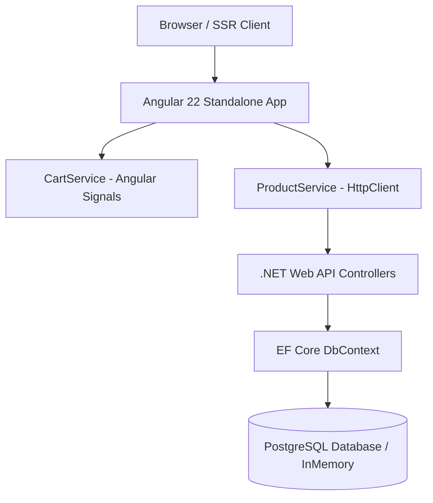

# 🥐 Moi Special — Artisan Patisserie & Luxury Bakery Full-Stack Application


A state-of-the-art, high-end **Full-Stack Web Application** designed for **Moi Special** — a luxury artisan bakery, patisserie & café located in Upper Mesopotamia (Şanlıurfa, Turkey). 

This project bridges traditional wood-fired stone oven craftsmanship with modern French patisserie elegance. Built with cutting-edge technologies including **Angular Standalone SSR**, **Angular Signals state management**, **Tailwind CSS v4**, **GSAP micro-animations**, and a robust **.NET Web API with EF Core**.

---

## 🎨 Design System & Visual Identity

The UI/UX design is rooted in the **"Modern Mesopotamian Artisan Heritage"** design system:

* **Urfa Limestone Cream (`#FFF8F2` / `#F6F1EA`):** Primary warm background, evoking sun-drenched stone courtyards.
* **Pistachio Emerald (`#526E48` / `#3B5532`):** Primary brand accent inspired by Antep boz pistachios.
* **Bakery Copper / Caramel (`#B87333`):** Interactive highlights and call-to-action buttons.
* **Sun-bleached Beige (`#EDE4D8`):** Container surfaces and card backgrounds.
* **Editorial Pair Typography:** `Playfair Display` for high-end serif headlines and `Hanken Grotesk` for sleek contemporary functional text.
* **Soft Arch Architectural Motif:** Custom top-rounded archway image frames and cards (`.arch-top-hero` & `.arch-card-img`).

---

## 🚀 Key Features

### 💻 Frontend (Angular Standalone + SSR + Signals + GSAP)
- **Glassmorphic Navigation Header:** Wordmark logo, responsive navigation links, and a reservation CTA button.
- **Reactive Cart State (Angular Signals):** Real-time shopping bag counter, item quantity updates, total price calculations without external state library bloat.
- **Slide-out Cart Drawer:** Side drawer displaying active bag items, quantity controls (+ / -), and instant total summary.
- **Hero Showcase:** Architectural archway visual container with high-resolution food photography and smooth GSAP entrance animations.
- **Interactive Menu Showcase:** Category filter tabs (*Fıstıklı Özel, Artisan Pastane, Taş Fırın & Ekmek, Gurme İçecekler*) with soft-arch product cards.

### ⚙️ Backend (.NET Web API + PostgreSQL EF Core)
- **RESTful Endpoints:** Product catalog (`/api/products`), category hierarchy (`/api/categories`), and session cart management (`/api/cart`).
- **Entity Framework Core:** Strongly typed entities (`Product`, `Category`, `CartItem`) with PostgreSQL provider support (`Npgsql`) and seamless InMemory fallback for quick evaluation.
- **Database Seeding:** Pre-configured initial dataset for artisanal products and categories.
- **CORS Configured:** Secure cross-origin resource sharing for frontend integration.

---

## 🛠️ Tech Stack & Architecture



| Layer | Technology |
| :--- | :--- |
| **Frontend Framework** | Angular v22 (Standalone Components, SSR) |
| **State Management** | Angular Signals (`signal`, `computed`, `asReadonly`) |
| **Styling & Theme** | Tailwind CSS v4 (`@theme` tokens) |
| **Animations** | GSAP (GreenSock Animation Platform) |
| **Backend Framework** | .NET Web API (C# 13 / .NET 9 & 10) |
| **ORM & Database** | Entity Framework Core, PostgreSQL (`Npgsql`) / InMemory |

---

## 🔒 Security & Environment Configuration

All sensitive parameters, database connection strings, and server credentials are abstracted using standard configuration patterns:
- Connection strings can be passed via environment variables or `appsettings.json` / `appsettings.Development.json`.
- No sensitive credentials or private tokens are stored in source control.

---

## 💻 Getting Started Locally

### Prerequisites
- Node.js (v18+ recommended) & npm
- .NET 9 or .NET 10 SDK

### 1. Frontend Setup (`moi-special`)
```bash
cd moi-special
npm install
npm start
```
*The Angular application will start at `http://localhost:4200`.*

### 2. Backend Setup (`MoiSpecial.Api`)
```bash
cd MoiSpecial.Api
dotnet restore
dotnet run
```
*The API server will listen on `http://localhost:5000` or `http://localhost:5001`.*

---

## 📄 License

Distributed under the **MIT License**. See `LICENSE` for more information.

---
*Crafted with passion for luxury patisserie and modern web design.*
