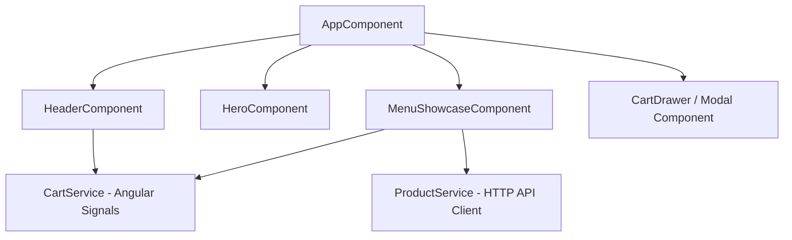

# Moi Special - Full-Stack Web Uygulaması Mimari & Uygulama Planı

Bu plan, **Moi Special** (Şanlıurfa merkezli lüks fırın, pastane & kafe) projesinin Stitch tasarım varlıkları ve Modern Mezopotamya Tasarım Sistemi doğrultusunda Full-Stack web uygulamasının geliştirilmesini adım adım detaylandırmaktadır.

---

## 🎨 Stitch Tasarım Analizi & Varlık Entegrasyonu

Stitch projesinden (`1017029718814766539`) çekilen renk paleti, tipografi hiyerarşisi ve tasarım motifleri projenin temel yapı taşlarını oluşturmaktadır:

### 1. Renk Paleti (Modern Mezopotamya Teması)
* **Kireçtaşı Krem / Urfa Limestone (`surface`):** `#FFF8F2` / `#F6F1EA` (Arka plan & geniş yüzeyler)
* **Güneş Yanığı Bej (`secondary-surface`):** `#EDE4D8` / `#E2D9CD` (Konteyner ve bölücü alanları)
* **Fıstık Yeşili (`primary`):** `#3B5532` / `#526E48` (Marka vurguları, başlıklar ve zümrüt detaylar)
* **Fırın Karamele Yakın Bakır / Bakır Işıltısı (`tertiary` / CTA):** `#B87333` / `#784000` / `#965719` (Butonlar ve etkileşimli elemanlar)
* **Derin Kömür Gri (`text`):** `#1F1B14` / `#2D2926` (Yüksek okunabilirlikte tipografi)
* **Yumuşak Bej Çerçeve (`outline`):** `#D6C9B6` / `#74796F` (Kart sınırları)

### 2. Tipografi Hiyerarşisi
* **Başlıklar & Editöryal Tipografi:** `Playfair Display` (Zarafet ve artisan mirası)
* **Gövde Metinleri & İşlevsel UI:** `Hanken Grotesk` (Modern, net geometri)
* **Kategori & Etiketler:** `label-caps` (0.1em letter-spacing, 12px UPPERCASE)

### 3. Mimari Motif (Soft Arch - Kemerli Yapı)
* Görseller ve kart tasarımlarında üst köşeler yuvarlatılmış kemer yapısı (`rounded-t-[3rem]` / `rounded-t-full`).

---

## 🛠️ Mimari & Proje Bileşenleri

### Frontend Bileşen Mimarisi (Angular 22 Standalone + Tailwind v4 + GSAP)



1. **Tailwind v4 Entegrasyonu (`src/styles.css`):**
   - `@theme` direktifi ile Stitch renk değişkenleri, `Playfair Display` ve `Hanken Grotesk` font aileleri tanımlanacak.
   - Özel kemer (soft arch) ve lüks gölge utility sınıfları eklenecek.

2. **State Yönetimi (Angular Signals):**
   - `CartService`: `signal<CartItem[]>` ile reaktif sepet yönetimi, toplam tutar `computed()`, ürün adedi rozet hesabı `computed()`.

3. **Bileşenler:**
   - **`HeaderComponent`:** Wordmark logosu (`f753e3df304640c7942d3043bd04d690`), navigasyon linkleri, `Bag (X)` sepet rozeti (Signals bağlantılı) ve "Rezervasyon Yap" CTA butonu.
   - **`HeroComponent`:** Editöryal typografik hiyerarşi, kemerli (archway) çerçeve içinde ultra yüksek çözünürlüklü fıstıklı kruvasan & entremet görseli (`01e6acd8d2dd4228b9db370abdd96987`), GSAP ile yumuşak giriş animasyonları.
   - **`MenuShowcaseComponent`:** Reaktif kategori filtreleme (Pastane, Fırın, Özel Tatlılar, İçecekler), kemerli kart yapısı, sepete ekleme/çıkarma butonları, fiyat ve etiket gösterimi.

---

### Backend Mimarisi (.NET 9 Web API + PostgreSQL EF Core)

```
MoiSpecial.Api/
├── Controllers/
│   ├── ProductsController.cs
│   ├── CategoriesController.cs
│   └── CartController.cs
├── Data/
│   ├── MoiSpecialDbContext.cs
│   └── DbInitializer.cs (Seed Data)
├── Models/
│   ├── Product.cs
│   ├── Category.cs
│   └── CartItem.cs
└── Program.cs (CORS, EF Core PostgreSQL config)
```

* **Varlık Modelleri (Entities):**
  - `Product`: Id, Name, Description, Price, ImageUrl, CategoryId, IsSpecialty, Tags, IsAvailable
  - `Category`: Id, Name, Description, Icon, DisplayOrder
  - `CartItem`: Id, ProductId, Quantity, UnitPrice, SessionId
* **Veritabanı Entegrasyonu:** PostgreSQL + Entity Framework Core (DbInitializer ile örnek lüks ürün ve kategorilerin tohumlanması).

---

## ❓ Kullanıcı Onayı Gerektiren Noktalar (User Review Required)

> [!IMPORTANT]
> **1. PostgreSQL Bağlantısı:** Bilgisayarınızda yerel PostgreSQL servisi çalışıyor mu, yoksa geliştirme aşamasında backend'i varsayılan InMemory / SQLite modunda başlatıp PostgreSQL bağlantı dizesini yapılandırılabilir yapmamızı ister misiniz?
> 
> **2. GSAP & Animasyon Detayı:** Hero alanında ve kart etkileşimlerinde yumuşak mikromotion animasyonları kullanıyoruz. Özel bir animasyon tercihi var mıdır?

---

## 📋 Önerilen Değişiklik Adımları

### 1. Frontend Yapılandırması (`moi-special`)

#### [MODIFY] [index.html](file:///c:/Users/Partridge/Desktop/MOIFIRIN/moi-special/src/index.html)
- Google Fonts (`Playfair Display` ve `Hanken Grotesk`) stil bağlantılarının eklenmesi.

#### [MODIFY] [styles.css](file:///c:/Users/Partridge/Desktop/MOIFIRIN/moi-special/src/styles.css)
- Tailwind v4 `@theme` yapılandırması: Renkler (`limestone`, `pistachio`, `copper`, `beige`, `charcoal`), tipografiler ve özel kemer sınıfları (`.arch-img-frame`, `.btn-copper`).

#### [NEW] [cart.service.ts](file:///c:/Users/Partridge/Desktop/MOIFIRIN/moi-special/src/app/services/cart.service.ts)
- Angular Signals tabanlı sepet state servisi.

#### [NEW] [product.service.ts](file:///c:/Users/Partridge/Desktop/MOIFIRIN/moi-special/src/app/services/product.service.ts)
- Backend API ve fallback mock verileri ile iletişim kuran ürün/kategori servisi.

#### [NEW] [header.component.ts](file:///c:/Users/Partridge/Desktop/MOIFIRIN/moi-special/src/app/components/header/header.component.ts)
- Modern lüks header, Wordmark logosu, navigasyon, `Bag (0)` rozeti ve Rezervasyon CTA.

#### [NEW] [hero.component.ts](file:///c:/Users/Partridge/Desktop/MOIFIRIN/moi-special/src/app/components/hero/hero.component.ts)
- Kemerli görsel alanı, editöryal başlık ve GSAP giriş efektleri olan Hero alanı.

#### [NEW] [menu-showcase.component.ts](file:///c:/Users/Partridge/Desktop/MOIFIRIN/moi-special/src/app/components/menu-showcase/menu-showcase.component.ts)
- Kategori sekme değişimi ve reaktif sepet destekli lüks ürün kartları gösterimi.

---

### 2. Backend Yapılandırması (`MoiSpecial.Api`)

#### [NEW] [MoiSpecial.Api.csproj](file:///c:/Users/Partridge/Desktop/MOIFIRIN/MoiSpecial.Api/MoiSpecial.Api.csproj)
- .NET Web API projesi ve gerekli EF Core / PostgreSQL NuGet paketleri.

#### [NEW] Modeller & DbContext
- `Models/Product.cs`, `Models/Category.cs`, `Models/CartItem.cs` ve `Data/MoiSpecialDbContext.cs`.

#### [NEW] Controllers
- `ProductsController.cs`, `CategoriesController.cs`, `CartController.cs`.

---

## 🔍 Doğrulama Planı (Verification Plan)

### Otomatik & Derleme Testleri
1. **Frontend:** `npm run build` komutunun hatasız tamamlanması, Angular SSR ve Signals tiplerinin doğrulanması.
2. **Backend:** `dotnet build` komutunun `.NET 9` Web API projesinde sorunsuz çalışması.

### Manuel Doğrulama
1. Header navigasyonu ve `Bag (X)` rozetinin sepete ürün eklendikçe reaktif güncellenmesi.
2. Hero alanındaki kemerli görselin ve tipografik hiyerarşinin Stitch Landing Page ile birebir görsel uyumunun kontrol edilmesi.
3. Kategori seçimleri değiştikçe menu showcase kartlarının dinamik süzülmesi.
